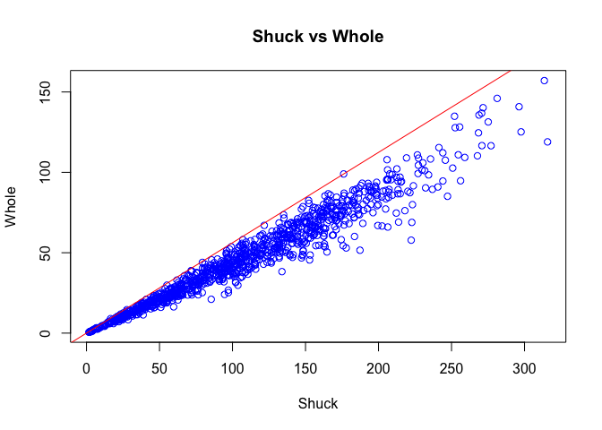

Abalone Data Analysis Part 1
================
Dalya Adams

Import dataset and view datatset stats

``` r
library(readr)
mydata <- read_csv("~/Desktop/Projects/Abalone_1/mydata.csv")
```

    ## Parsed with column specification:
    ## cols(
    ##   SEX = col_character(),
    ##   LENGTH = col_double(),
    ##   DIAM = col_double(),
    ##   HEIGHT = col_double(),
    ##   WHOLE = col_double(),
    ##   SHUCK = col_double(),
    ##   RINGS = col_integer(),
    ##   CLASS = col_character(),
    ##   VOLUME = col_double(),
    ##   RATIO = col_double()
    ## )

``` r
str(mydata)
```

    ## Classes 'tbl_df', 'tbl' and 'data.frame':    1036 obs. of  10 variables:
    ##  $ SEX   : chr  "I" "I" "I" "I" ...
    ##  $ LENGTH: num  5.57 3.67 10.08 4.09 6.93 ...
    ##  $ DIAM  : num  4.09 2.62 7.35 3.15 4.83 ...
    ##  $ HEIGHT: num  1.26 0.84 2.205 0.945 1.785 ...
    ##  $ WHOLE : num  11.5 3.5 79.38 4.69 21.19 ...
    ##  $ SHUCK : num  4.31 1.19 44 2.25 9.88 ...
    ##  $ RINGS : int  6 4 6 3 6 6 5 6 5 6 ...
    ##  $ CLASS : chr  "A1" "A1" "A1" "A1" ...
    ##  $ VOLUME: num  28.7 8.1 163.4 12.2 59.7 ...
    ##  $ RATIO : num  0.15 0.147 0.269 0.185 0.165 ...
    ##  - attr(*, "spec")=List of 2
    ##   ..$ cols   :List of 10
    ##   .. ..$ SEX   : list()
    ##   .. .. ..- attr(*, "class")= chr  "collector_character" "collector"
    ##   .. ..$ LENGTH: list()
    ##   .. .. ..- attr(*, "class")= chr  "collector_double" "collector"
    ##   .. ..$ DIAM  : list()
    ##   .. .. ..- attr(*, "class")= chr  "collector_double" "collector"
    ##   .. ..$ HEIGHT: list()
    ##   .. .. ..- attr(*, "class")= chr  "collector_double" "collector"
    ##   .. ..$ WHOLE : list()
    ##   .. .. ..- attr(*, "class")= chr  "collector_double" "collector"
    ##   .. ..$ SHUCK : list()
    ##   .. .. ..- attr(*, "class")= chr  "collector_double" "collector"
    ##   .. ..$ RINGS : list()
    ##   .. .. ..- attr(*, "class")= chr  "collector_integer" "collector"
    ##   .. ..$ CLASS : list()
    ##   .. .. ..- attr(*, "class")= chr  "collector_character" "collector"
    ##   .. ..$ VOLUME: list()
    ##   .. .. ..- attr(*, "class")= chr  "collector_double" "collector"
    ##   .. ..$ RATIO : list()
    ##   .. .. ..- attr(*, "class")= chr  "collector_double" "collector"
    ##   ..$ default: list()
    ##   .. ..- attr(*, "class")= chr  "collector_guess" "collector"
    ##   ..- attr(*, "class")= chr "col_spec"

Convert specific columns to factor

``` r
mydata$CLASS<-as.factor(mydata$CLASS)
mydata$SEX<-as.factor(mydata$SEX)
#str(mydata)
```

Create new variables

``` r
mydata$VOLUME<-mydata$LENGTH*mydata$DIAM*mydata$HEIGHT
mydata$RATIO<-mydata$SHUCK/mydata$VOLUME
```

View Summary of entire dataset, including engineered features

``` r
summary(mydata)
```

    ##  SEX         LENGTH           DIAM            HEIGHT     
    ##  F:326   Min.   : 2.73   Min.   : 1.995   Min.   :0.525  
    ##  I:329   1st Qu.: 9.45   1st Qu.: 7.350   1st Qu.:2.415  
    ##  M:381   Median :11.45   Median : 8.925   Median :2.940  
    ##          Mean   :11.08   Mean   : 8.622   Mean   :2.947  
    ##          3rd Qu.:13.02   3rd Qu.:10.185   3rd Qu.:3.570  
    ##          Max.   :16.80   Max.   :13.230   Max.   :4.935  
    ##      WHOLE             SHUCK              RINGS        CLASS   
    ##  Min.   :  1.625   Min.   :  0.5625   Min.   : 3.000   A1:108  
    ##  1st Qu.: 56.484   1st Qu.: 23.3006   1st Qu.: 8.000   A2:236  
    ##  Median :101.344   Median : 42.5700   Median : 9.000   A3:329  
    ##  Mean   :105.832   Mean   : 45.4396   Mean   : 9.993   A4:188  
    ##  3rd Qu.:150.319   3rd Qu.: 64.2897   3rd Qu.:11.000   A5:175  
    ##  Max.   :315.750   Max.   :157.0800   Max.   :25.000           
    ##      VOLUME            RATIO        
    ##  Min.   :  3.612   Min.   :0.06734  
    ##  1st Qu.:163.545   1st Qu.:0.12241  
    ##  Median :307.363   Median :0.13914  
    ##  Mean   :326.804   Mean   :0.14205  
    ##  3rd Qu.:463.264   3rd Qu.:0.15911  
    ##  Max.   :995.673   Max.   :0.31176

Another look at summary stats of dataset

``` r
mytable<-table(mydata$SEX, mydata$CLASS)
addmargins(mytable)
```

    ##      
    ##         A1   A2   A3   A4   A5  Sum
    ##   F      5   41  121   82   77  326
    ##   I     91  133   65   21   19  329
    ##   M     12   62  143   85   79  381
    ##   Sum  108  236  329  188  175 1036

``` r
barplot(mytable, main = "Comparison of Sex and Class of Abalones", ylab = "Frequency", ylim = c(0,170), xlab = "Class", beside = TRUE, col = c("mistyrose", "cornsilk", "lightblue"))
legend("topright", inset = .02, title = "Sex of Abalones", c("Female", "Infant", "Male"), fill=c("mistyrose", "cornsilk", "lightblue"), cex=0.8 )
```


View relationship of variable to each other (Checking for collinearity)

``` r
set.seed(123)
work<-mydata[sample(nrow(mydata), 200), ]
plot(work[,2:6])
```


View the relationship betwen Volume and Whole weight

``` r
plot(mydata$VOLUME,mydata$WHOLE,xlab="Volume", ylab="Whole", main = "Volume vs Whole", col="red" )
```

 View the relationship between Shuck weight and Whole weight

``` r
plot( mydata$WHOLE,mydata$SHUCK, xlab="Shuck", ylab="Whole", main = "Shuck vs Whole", col="blue")
abline(a=0, b=(max(mydata$SHUCK/mydata$WHOLE)), col= "red") 
```



View stats for subsetted data

``` r
par(mfrow=c(3,3))
#Create subsets by gender
femaleratio<-subset(mydata$RATIO, mydata$SEX=="F")
infantratio<-subset(mydata$RATIO, mydata$SEX=="I")
maleratio<-subset(mydata$RATIO, mydata$SEX=="M")

#Create histograms
hist(femaleratio, main = "Ratio-Female", ylab = "Frequency", xlab = "Ratio", col = "mistyrose" )
hist(infantratio, main = "Ratio-Infant", ylab = "Frequency", xlab = "Ratio", col = "yellow" )
hist(maleratio, main = "Ratio-Male", ylab = "Frequency", xlab = "Ratio", col = "lightblue" )
#Create boxplots
boxplot(femaleratio, range = 1.5, main = "Ratio-Female", col = "mistyrose")
boxplot(infantratio, range = 1.5, main = "Ratio-Infant", col = "yellow")
boxplot(maleratio, range = 1.5, main = "Ratio-Male", col = "lightblue")
#Create QQ Plots
qqnorm(femaleratio, main = "Q-Q Plot for Female ratio", ylab = "Sample Quantiles for Female ratio", col="mistyrose")
qqline(femaleratio, col="green")
qqnorm(infantratio, main = "Q-Q Plot for Infant ratio", ylab = "Sample Quantiles for Infant ratio", col="yellow")
qqline(infantratio, col="green")
qqnorm(maleratio, main = "Q-Q Plot for Male ratio", ylab = "Sample Quantiles for Male ratio", col="lightblue")
qqline(maleratio, col="green")
```


``` r
par(mfrow=c(1,1))
```

Identify which observations are outliers and extreme outliers for each subset

``` r
boxplot.stats(femaleratio, coef = 1.5)
```

    ## $stats
    ## [1] 0.07174086 0.12123374 0.13808946 0.15542149 0.20522327
    ## 
    ## $n
    ## [1] 326
    ## 
    ## $conf
    ## [1] 0.1350978 0.1410812
    ## 
    ## $out
    ## [1] 0.31176204 0.21216140 0.21465603 0.21306058 0.23497668 0.06733877

``` r
boxplot.stats(femaleratio, coef = 3.0)
```

    ## $stats
    ## [1] 0.06733877 0.12123374 0.13808946 0.15542149 0.23497668
    ## 
    ## $n
    ## [1] 326
    ## 
    ## $conf
    ## [1] 0.1350978 0.1410812
    ## 
    ## $out
    ## [1] 0.311762

``` r
boxplot.stats(infantratio, coef = 1.5)
```

    ## $stats
    ## [1] 0.07808601 0.12314437 0.14159986 0.15948490 0.21142642
    ## 
    ## $n
    ## [1] 329
    ## 
    ## $conf
    ## [1] 0.1384343 0.1447654
    ## 
    ## $out
    ## [1] 0.2693371 0.2218308 0.2403394 0.2263294 0.2249577 0.2300704 0.2290478
    ## [8] 0.2232339

``` r
boxplot.stats(infantratio, coef = 3.0)
```

    ## $stats
    ## [1] 0.07808601 0.12314437 0.14159986 0.15948490 0.24033943
    ## 
    ## $n
    ## [1] 329
    ## 
    ## $conf
    ## [1] 0.1384343 0.1447654
    ## 
    ## $out
    ## [1] 0.2693371

``` r
boxplot.stats(maleratio, coef = 1.5)
```

    ## $stats
    ## [1] 0.07171905 0.12228101 0.13776396 0.16085876 0.21627955
    ## 
    ## $n
    ## [1] 381
    ## 
    ## $conf
    ## [1] 0.1346412 0.1408867
    ## 
    ## $out
    ## [1] 0.2609861 0.2378764 0.2345924 0.2356349 0.2286735

``` r
boxplot.stats(maleratio, coef = 3.0)
```

    ## $stats
    ## [1] 0.07171905 0.12228101 0.13776396 0.16085876 0.26098609
    ## 
    ## $n
    ## [1] 381
    ## 
    ## $conf
    ## [1] 0.1346412 0.1408867
    ## 
    ## $out
    ## numeric(0)

``` r
#Need to identify which Abalones are the ouliers. 
which(femaleratio>=.212)
```

    ## [1]  21  50  91  92 129

``` r
which(femaleratio<=0.0674)
```

    ## [1] 257

``` r
which(infantratio>=.2218)
```

    ## [1]   3  37  42  58  67  89 105 200

``` r
which(maleratio>=0.2286)
```

    ## [1]  91  99 148 155 197

``` r
#Matrix of all values
female<-subset(mydata, mydata$SEX=="F")
infant<-subset(mydata, mydata$SEX=="I")
male<-subset(mydata, mydata$SEX=="M")
female[c(21,50,91,92,129,257),]
```

    ## # A tibble: 6 x 10
    ##   SEX   LENGTH  DIAM HEIGHT WHOLE SHUCK RINGS CLASS VOLUME  RATIO
    ##   <fct>  <dbl> <dbl>  <dbl> <dbl> <dbl> <int> <fct>  <dbl>  <dbl>
    ## 1 F       7.98  6.72   2.42  80.9  40.4     7 A2      130. 0.312 
    ## 2 F      15.3  12.0    3.46 252.  135.     10 A3      636. 0.212 
    ## 3 F      11.6   7.98   3.46 151.   68.6    10 A3      319. 0.215 
    ## 4 F      13.1  10.3    2.31 142.   66.5     9 A3      312. 0.213 
    ## 5 F      11.4   8.09   3.15 140.   68.5     9 A3      291. 0.235 
    ## 6 F      12.2   9.45   4.93 134.   38.2    14 A5      568. 0.0673

``` r
infant[c(3,37,42,58,67,89,105,200),]
```

    ## # A tibble: 8 x 10
    ##   SEX   LENGTH  DIAM HEIGHT WHOLE  SHUCK RINGS CLASS VOLUME RATIO
    ##   <fct>  <dbl> <dbl>  <dbl> <dbl>  <dbl> <int> <fct>  <dbl> <dbl>
    ## 1 I      10.1   7.35  2.20  79.4  44.0       6 A1    163.   0.269
    ## 2 I       4.30  3.26  0.945  6.19  2.94      3 A1     13.2  0.222
    ## 3 I       2.84  2.73  0.840  3.62  1.56      4 A1      6.50 0.240
    ## 4 I       6.72  4.30  1.68  22.6  11.0       5 A1     48.6  0.226
    ## 5 I       5.04  3.68  0.945  9.66  3.94      5 A1     17.5  0.225
    ## 6 I       3.36  2.31  0.525  2.44  0.938     4 A1      4.07 0.230
    ## 7 I       6.93  4.72  1.58  23.4  11.8       7 A2     51.6  0.229
    ## 8 I       9.14  6.30  2.52  74.6  32.4       8 A2    145.   0.223

``` r
male[c(91,99,148,155,197),]
```

    ## # A tibble: 5 x 10
    ##   SEX   LENGTH  DIAM HEIGHT WHOLE SHUCK RINGS CLASS VOLUME RATIO
    ##   <fct>  <dbl> <dbl>  <dbl> <dbl> <dbl> <int> <fct>  <dbl> <dbl>
    ## 1 M       13.4 10.8    1.68  130.  63.7    10 A3      244. 0.261
    ## 2 M       10.5  7.77   3.15  133.  61.1     9 A3      257. 0.238
    ## 3 M       10.7  8.61   3.26  160.  70.4     9 A3      300. 0.235
    ## 4 M       12.3  9.87   3.46  176.  99.0    10 A3      420. 0.236
    ## 5 M       11.6  8.82   3.36  168.  78.3    10 A3      342. 0.229

``` r
summary(infant)
```

    ##  SEX         LENGTH            DIAM            HEIGHT     
    ##  F:  0   Min.   : 2.730   Min.   : 1.995   Min.   :0.525  
    ##  I:329   1st Qu.: 7.665   1st Qu.: 5.775   1st Qu.:1.890  
    ##  M:  0   Median : 9.240   Median : 7.035   Median :2.310  
    ##          Mean   : 9.100   Mean   : 6.928   Mean   :2.297  
    ##          3rd Qu.:10.920   3rd Qu.: 8.400   3rd Qu.:2.730  
    ##          Max.   :15.225   Max.   :11.550   Max.   :4.620  
    ##      WHOLE             SHUCK             RINGS        CLASS   
    ##  Min.   :  1.625   Min.   : 0.5625   Min.   : 3.000   A1: 91  
    ##  1st Qu.: 26.938   1st Qu.:11.4375   1st Qu.: 6.000   A2:133  
    ##  Median : 48.000   Median :21.2500   Median : 8.000   A3: 65  
    ##  Mean   : 56.055   Mean   :24.2566   Mean   : 7.967   A4: 21  
    ##  3rd Qu.: 78.312   3rd Qu.:35.0924   3rd Qu.: 9.000   A5: 19  
    ##  Max.   :256.188   Max.   :94.7537   Max.   :20.000           
    ##      VOLUME            RATIO        
    ##  Min.   :  3.612   Min.   :0.07809  
    ##  1st Qu.: 83.266   1st Qu.:0.12314  
    ##  Median :148.452   Median :0.14160  
    ##  Mean   :175.299   Mean   :0.14486  
    ##  3rd Qu.:247.380   3rd Qu.:0.15948  
    ##  Max.   :812.421   Max.   :0.26934

``` r
#install.packages(c("ggplot2", "gridExtra", "moments"))
library(ggplot2)
library(gridExtra)
```

Side by side boxplots of each class for whole and volume

``` r
par(mfrow=c(2,2))
boxplot(mydata$VOLUME~mydata$CLASS, data = mydata, xlab="Class", ylab="Volume")
boxplot(mydata$WHOLE~mydata$CLASS, data = mydata, xlab="Class", ylab="Whole")
```


Scatterplot of volume vs rings and whole vs rings

``` r
plot(mydata$VOLUME, mydata$RINGS, col="red", xlab = "Volume", ylab = "Rings")
```


``` r
plot(mydata$WHOLE, mydata$RINGS, col="blue", xlab = "Whole", ylab = "Rings")
```


``` r
par(mfrow=c(1,1))
```

``` r
agg.vol<-aggregate(VOLUME~SEX+CLASS, data=mydata, mean)
agg.shuck<-aggregate(SHUCK~SEX+CLASS, data=mydata, mean)
agg.ratio<-aggregate(RATIO~SEX+CLASS, data=mydata, mean)
```

Create matrix of mean values

``` r
matrix(agg.vol[,3], nrow=3, ncol=5, byrow=FALSE, dimnames = list(c("Female", "Infant","Male"), c("A1","A2","A3","A4", "A5")))
```

    ##               A1       A2       A3       A4       A5
    ## Female 255.29938 276.8573 412.6079 498.0489 486.1525
    ## Infant  66.51618 160.3200 270.7406 316.4129 318.6930
    ## Male   103.72320 245.3857 358.1181 442.6155 440.2074

``` r
matrix(agg.shuck[,3], nrow=3, ncol=5, byrow=FALSE, dimnames = list(c("Female", "Infant","Male"), c("A1","A2","A3","A4", "A5")))
```

    ##              A1       A2       A3       A4       A5
    ## Female 38.90000 42.50305 59.69121 69.05161 59.17076
    ## Infant 10.11332 23.41024 37.17969 39.85369 36.47047
    ## Male   16.39583 38.33855 52.96933 61.42726 55.02762

``` r
matrix(agg.ratio[,3], nrow=3, ncol=5, byrow=FALSE, dimnames = list(c("Female", "Infant","Male"), c("A1","A2","A3","A4", "A5")))
```

    ##               A1        A2        A3        A4        A5
    ## Female 0.1546644 0.1554605 0.1450304 0.1379609 0.1233605
    ## Infant 0.1569554 0.1475600 0.1372256 0.1244413 0.1167649
    ## Male   0.1512698 0.1564017 0.1462123 0.1364881 0.1262089

``` r
ggplot(data=agg.vol, aes(x=CLASS, y=VOLUME, group=SEX, color=SEX))+geom_line()+geom_point(size=4)+ggtitle("Plot of Mean Volume versus Class for three sexes")
```


``` r
ggplot(data=agg.shuck, aes(x=CLASS, y=SHUCK, group=SEX, color=SEX))+geom_line()+geom_point(size=4)+ggtitle("Plot of Mean Shuck versus Class for three sexes")
```


``` r
ggplot(data=agg.ratio, aes(x=CLASS, y=RATIO, group=SEX, color=SEX))+geom_line()+geom_point(size=4)+ggtitle("Plot of Mean Ratio versus Class for three sexes")
```


