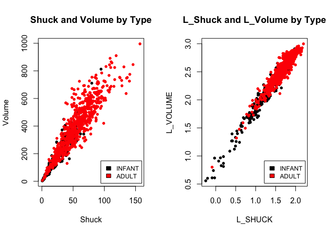

Abalone Data Analysis Part 2
================
Adams, Dalya

Import libraries, file and view sumary statistics

``` r
library(flux)
library(ggplot2)
library(gridExtra)
library(rockchalk)
library(car)
library(readr)

mydata <- read_csv("~/Desktop/Projects/Abalone_1/mydata.csv")
str(mydata)
```

    ## Classes 'tbl_df', 'tbl' and 'data.frame':    1036 obs. of  10 variables:
    ##  $ SEX   : chr  "I" "I" "I" "I" ...
    ##  $ LENGTH: num  5.57 3.67 10.08 4.09 6.93 ...
    ##  $ DIAM  : num  4.09 2.62 7.35 3.15 4.83 ...
    ##  $ HEIGHT: num  1.26 0.84 2.205 0.945 1.785 ...
    ##  $ WHOLE : num  11.5 3.5 79.38 4.69 21.19 ...
    ##  $ SHUCK : num  4.31 1.19 44 2.25 9.88 ...
    ##  $ RINGS : int  6 4 6 3 6 6 5 6 5 6 ...
    ##  $ CLASS : chr  "A1" "A1" "A1" "A1" ...
    ##  $ VOLUME: num  28.7 8.1 163.4 12.2 59.7 ...
    ##  $ RATIO : num  0.15 0.147 0.269 0.185 0.165 ...
    ##  - attr(*, "spec")=List of 2
    ##   ..$ cols   :List of 10
    ##   .. ..$ SEX   : list()
    ##   .. .. ..- attr(*, "class")= chr  "collector_character" "collector"
    ##   .. ..$ LENGTH: list()
    ##   .. .. ..- attr(*, "class")= chr  "collector_double" "collector"
    ##   .. ..$ DIAM  : list()
    ##   .. .. ..- attr(*, "class")= chr  "collector_double" "collector"
    ##   .. ..$ HEIGHT: list()
    ##   .. .. ..- attr(*, "class")= chr  "collector_double" "collector"
    ##   .. ..$ WHOLE : list()
    ##   .. .. ..- attr(*, "class")= chr  "collector_double" "collector"
    ##   .. ..$ SHUCK : list()
    ##   .. .. ..- attr(*, "class")= chr  "collector_double" "collector"
    ##   .. ..$ RINGS : list()
    ##   .. .. ..- attr(*, "class")= chr  "collector_integer" "collector"
    ##   .. ..$ CLASS : list()
    ##   .. .. ..- attr(*, "class")= chr  "collector_character" "collector"
    ##   .. ..$ VOLUME: list()
    ##   .. .. ..- attr(*, "class")= chr  "collector_double" "collector"
    ##   .. ..$ RATIO : list()
    ##   .. .. ..- attr(*, "class")= chr  "collector_double" "collector"
    ##   ..$ default: list()
    ##   .. ..- attr(*, "class")= chr  "collector_guess" "collector"
    ##   ..- attr(*, "class")= chr "col_spec"

``` r
mydata$SEX<-as.factor(mydata$SEX)
mydata$CLASS<-as.factor(mydata$CLASS)
```

------------------------------------------------------------------------

Histogram,QQ plot, Skewness and Kurtosis using RATIO.

``` r
par(mfrow=c(1,2))

hist(mydata$RATIO, col = "red", main = "Histogram of Ratio", xlab = "Ratio")
qqnorm(mydata$RATIO, col = "red", main = "QQ Plot of Ratio")
qqline(mydata$RATIO, col = "green", lty = 2, lwd = 2)
```


``` r
skewness(mydata$RATIO)
```

    ## [1] 0.7147056

``` r
kurtosis(mydata$RATIO)
```

    ## [1] 1.667298

Tranform RATIO using log10() to create L\_RATIO Histogram, QQ plot, Skewness and Kurtosis using L\_RATIO. Six boxplots of L\_RATIO differentiated by CLASS.

``` r
L_RATIO<- log10(mydata$RATIO)

par(mfrow=c(1,2))

hist(L_RATIO, col = "blue", main = "Histogram of Log Ratio", xlab = "L_Ratio")
qqnorm(L_RATIO, col = "blue", main = "QQ Plot of L_RATIO")
qqline(L_RATIO, col = "green", lty = 2, lwd = 2)
```


``` r
skewness(L_RATIO)
```

    ## [1] -0.09391548

``` r
kurtosis(L_RATIO)
```

    ## [1] 0.5354309

``` r
par(mfrow=c(1,1))
boxplot(L_RATIO~mydata$CLASS, col=c("blue", "purple", "red","pink", "Orange"), main = "Boxplot of L_Ratio across class")
```


Test the homogeneity of variance across classes using the bartlett.test()

``` r
bartlett.test(mydata$RATIO ~ mydata$CLASS, data = mydata)
```

    ## 
    ##  Bartlett test of homogeneity of variances
    ## 
    ## data:  mydata$RATIO by mydata$CLASS
    ## Bartlett's K-squared = 21.49, df = 4, p-value = 0.0002531

``` r
bartlett.test(L_RATIO ~ mydata$CLASS, data = mydata)
```

    ## 
    ##  Bartlett test of homogeneity of variances
    ## 
    ## data:  L_RATIO by mydata$CLASS
    ## Bartlett's K-squared = 3.1891, df = 4, p-value = 0.5267

Based on the above, we reject the null hypothesis that the variances are homogenous for the non transformed data. For the log transformed data, we fail to reject the null hypothesis that the variance is homogenous. Visually, viewing the Ratio QQ plot, we see that the data exhibits signs of fat tails, with the divergence from the normal distribution at the tails. This effect is minimized significantly once we transform the data using log10. The log transformed data exhibits better conformance to the normal distribution. Despite this, we still see extreme outliers in the boxplots, specifically Class A3.

<table style="width:7%;">
<colgroup>
<col width="6%" />
</colgroup>
<tbody>
<tr class="odd">
<td>Perform an analysis of variance with aov() on L_RATIO using CLASS and SEX as the independent variables Peform two analyses. First, fit a model with the interaction term CLASS:SEX. Then, fit a model without CLASS:SEX.</td>
</tr>
<tr class="even">
<td>```r nointer&lt;-aov(L_RATIO<sub>mydata<span class="math inline"><em>C</em><em>L</em><em>A</em><em>S</em><em>S</em> + <em>m</em><em>y</em><em>d</em><em>a</em><em>t</em><em>a</em></span>SEX) inter&lt;-aov(L_RATIO</sub>mydata<span class="math inline"><em>C</em><em>L</em><em>A</em><em>S</em><em>S</em> + <em>m</em><em>y</em><em>d</em><em>a</em><em>t</em><em>a</em></span>SEX+mydata<span class="math inline"><em>C</em><em>L</em><em>A</em><em>S</em><em>S</em> * <em>m</em><em>y</em><em>d</em><em>a</em><em>t</em><em>a</em></span>SEX)</td>
</tr>
<tr class="odd">
<td>summary(inter) ```</td>
</tr>
<tr class="even">
<td><code>##                           Df Sum Sq Mean Sq F value  Pr(&gt;F) ## mydata$CLASS               4  1.055 0.26384  38.370 &lt; 2e-16 *** ## mydata$SEX                 2  0.091 0.04569   6.644 0.00136 ** ## mydata$CLASS:mydata$SEX    8  0.027 0.00334   0.485 0.86709 ## Residuals               1021  7.021 0.00688 ## --- ## Signif. codes:  0 '***' 0.001 '**' 0.01 '*' 0.05 '.' 0.1 ' ' 1</code></td>
</tr>
<tr class="odd">
<td><code>r summary(nointer)</code></td>
</tr>
<tr class="even">
<td><code>##                Df Sum Sq Mean Sq F value  Pr(&gt;F) ## mydata$CLASS    4  1.055 0.26384  38.524 &lt; 2e-16 *** ## mydata$SEX      2  0.091 0.04569   6.671 0.00132 ** ## Residuals    1029  7.047 0.00685 ## --- ## Signif. codes:  0 '***' 0.001 '**' 0.01 '*' 0.05 '.' 0.1 ' ' 1</code></td>
</tr>
<tr class="odd">
<td>The lack of significance of the interaction terms suggests that these two variables do not cross or interact with each other. Class does not influence sex and sex does not influence class. They are independent of each other. If we were to graph sex and class, these lines would be parallel and never cross or interact with each other. Since Class and Sex are both significant in this model, we can drop the interaction term since there is no relationship/interaction being missed by dropping the interaction term.</td>
</tr>
<tr class="even">
<td>For the model without CLASS:SEX (nointer), obtain multiple comparisons with the TukeyHSD() function.</td>
</tr>
<tr class="odd">
<td><code>r TukeyHSD(nointer, conf.level = 0.95)</code></td>
</tr>
<tr class="even">
<td><code>##   Tukey multiple comparisons of means ##     95% family-wise confidence level ## ## Fit: aov(formula = L_RATIO ~ mydata$CLASS + mydata$SEX) ## ## $`mydata$CLASS` ##              diff         lwr          upr     p adj ## A2-A1 -0.01248831 -0.03876038  0.013783756 0.6919456 ## A3-A1 -0.03426008 -0.05933928 -0.009180867 0.0018630 ## A4-A1 -0.05863763 -0.08594237 -0.031332896 0.0000001 ## A5-A1 -0.09997200 -0.12764430 -0.072299703 0.0000000 ## A3-A2 -0.02177176 -0.04106269 -0.002480831 0.0178413 ## A4-A2 -0.04614932 -0.06825638 -0.024042262 0.0000002 ## A5-A2 -0.08748369 -0.11004316 -0.064924223 0.0000000 ## A4-A3 -0.02437756 -0.04505283 -0.003702280 0.0114638 ## A5-A3 -0.06571193 -0.08687025 -0.044553605 0.0000000 ## A5-A4 -0.04133437 -0.06508845 -0.017580286 0.0000223 ## ## $`mydata$SEX` ##             diff          lwr           upr     p adj ## I-F -0.015890329 -0.031069561 -0.0007110968 0.0376673 ## M-F  0.002069057 -0.012585555  0.0167236690 0.9412689 ## M-I  0.017959386  0.003340824  0.0325779478 0.0111881</code></td>
</tr>
<tr class="odd">
<td>At a 5% level of significance, we reject the null hypothesis that the difference of means for all variable combinations is 0, except A2-A1 and M-F. These results suggest that M-F and A2-A1 can be combined. In the case of M-F, they can be combined to create a new variable, Adult. A2-A1, the combination is not as simple, since infant already exists and these classes likely correlate with the sex classification Infant.</td>
</tr>
</tbody>
</table>

Use combineLevels() to combine "M" and "F" into a new level, "ADULT". This will necessitate defining a new variable, TYPE, in mydata which will have two levels: "I" and "ADULT". Use par() to form two histograms of VOLUME. One should display infant volumes, and the other: adult volumes.

``` r
mydata$TYPE <- combineLevels(mydata$SEX, levs = c("F","M"), "ADULT")
```

    ## The original levels F I M 
    ## have been replaced by I ADULT

``` r
summary(mydata)
```

    ##  SEX         LENGTH           DIAM            HEIGHT     
    ##  F:326   Min.   : 2.73   Min.   : 1.995   Min.   :0.525  
    ##  I:329   1st Qu.: 9.45   1st Qu.: 7.350   1st Qu.:2.415  
    ##  M:381   Median :11.45   Median : 8.925   Median :2.940  
    ##          Mean   :11.08   Mean   : 8.622   Mean   :2.947  
    ##          3rd Qu.:13.02   3rd Qu.:10.185   3rd Qu.:3.570  
    ##          Max.   :16.80   Max.   :13.230   Max.   :4.935  
    ##      WHOLE             SHUCK              RINGS        CLASS   
    ##  Min.   :  1.625   Min.   :  0.5625   Min.   : 3.000   A1:108  
    ##  1st Qu.: 56.484   1st Qu.: 23.3006   1st Qu.: 8.000   A2:236  
    ##  Median :101.344   Median : 42.5700   Median : 9.000   A3:329  
    ##  Mean   :105.832   Mean   : 45.4396   Mean   : 9.993   A4:188  
    ##  3rd Qu.:150.319   3rd Qu.: 64.2897   3rd Qu.:11.000   A5:175  
    ##  Max.   :315.750   Max.   :157.0800   Max.   :25.000           
    ##      VOLUME            RATIO            TYPE    
    ##  Min.   :  3.612   Min.   :0.06734   I    :329  
    ##  1st Qu.:163.545   1st Qu.:0.12241   ADULT:707  
    ##  Median :307.363   Median :0.13914              
    ##  Mean   :326.804   Mean   :0.14205              
    ##  3rd Qu.:463.264   3rd Qu.:0.15911              
    ##  Max.   :995.673   Max.   :0.31176

``` r
par(mfrow=c(1,2))
inf.volume<-subset(mydata$VOLUME, mydata$TYPE=="I")
adult.volume<-subset(mydata$VOLUME, mydata$TYPE=="ADULT")

hist(inf.volume, main= "Infant Volume", col = "pink")
hist(adult.volume, main = "Adult Volume", col = "red")
```


Infant Abalones volumes are grouped closer to the left tail of the histogram. This indicates that the weights of abalones categorized as infants builds up between 0 to 200. The volume of adult abalone is higher than that of infants. The majority of adult volumes are between 300 and 600. While it is clear there is a distinction in the average volume of an adult abalone and an infant abalone, there is still a high frequency of adult abalone with weights common for infants and infant abalone with weights common for adult abalone. This will likely mean there isn't a clear-cut way to separate infant and adult abalone based on volume. Using volume as the deciding factor for harvesting abalone or not will always result in some infants being harvested or some adults not being harvested.

Scatterplot of SHUCK versus VOLUME and a scatterplot of their base ten logarithms, labeling the variables as L\_SHUCK and L\_VOLUME.

``` r
L_SHUCK<-log10(mydata$SHUCK)
L_VOLUME<-log10(mydata$VOLUME)

#By Class
par(mfrow=c(1,2))
with(mydata, plot(mydata$SHUCK, mydata$VOLUME, col=mydata$CLASS, pch=20, xlab="Shuck", ylab = "Volume", main = "Shuck and Volume by Class"))
legend("bottomright",inset = .02, c("A1","A2","A3","A4","A5"), fill = c("black", "red", "green", "blue", "skyblue"),cex = 0.8)

with(mydata, plot(L_SHUCK, L_VOLUME, col=mydata$CLASS, pch=20, main = "L_Shuck and L_Volume by Class"))
legend("bottomright", inset = .02, c("A1","A2","A3","A4","A5"), fill = c("black", "red", "green", "blue", "skyblue"), cex = 0.8)
```


``` r
#by TYPE
par(mfrow=c(1,2))
with(mydata, plot(mydata$SHUCK, mydata$VOLUME, col=mydata$TYPE, pch=20, xlab="Shuck", ylab = "Volume", main = "Shuck and Volume by Type"))
legend("bottomright",inset = .02, c("INFANT","ADULT"), fill = c("black", "red"),cex = 0.8)

with(mydata, plot(L_SHUCK, L_VOLUME, col=mydata$TYPE, pch=20, main = "L_Shuck and L_Volume by Type"))
legend("bottomright",inset = .02, c("INFANT","ADULT"), fill = c("black", "red"),cex = 0.8)
```



Prior to the log transformation, shuck and volume exhibited a strong positive linear correlation. After the log transformation this positive linear relationship was still present. Something that the log transformation appears to have done is separate the infant data points from the adult data points. In both scatterplots for the non-transformed data, all classes and types are grouped together and there is not a clear distinction between the different classes or types. Once the log transformation is applied, Class A1 shows as a distinct class, in black and the separation between infant and adult also becomes clear, with infant being black and adult being red.

<table style="width:7%;">
<colgroup>
<col width="6%" />
</colgroup>
<tbody>
<tr class="odd">
<td>Since abalone growth slows after class A3, infants in classes A4 and A5 are considered mature and candidates for harvest. Reclassify the infants in classes A4 and A5 as ADULTS. Regress L_SHUCK as the dependent variable on L_VOLUME, CLASS and TYPE. Use the multiple regression model: L_SHUCK ~ L_VOLUME + CLASS + TYPE.</td>
</tr>
<tr class="even">
<td><code>r mydata$TYPE[mydata$CLASS==&quot;A4&quot;|mydata$CLASS==&quot;A5&quot;]&lt;-combineLevels(mydata$TYPE[mydata$CLASS==&quot;A4&quot;|mydata$CLASS==&quot;A5&quot;], levs = c(&quot;I&quot;,&quot;ADULT&quot;),&quot;ADULT&quot;)</code></td>
</tr>
<tr class="odd">
<td><code>## The original levels I ADULT ## have been replaced by ADULT</code></td>
</tr>
<tr class="even">
<td><code>r regression&lt;-lm(L_SHUCK~L_VOLUME+CLASS+TYPE, data = mydata) summary(regression)</code></td>
</tr>
<tr class="odd">
<td><code>## ## Call: ## lm(formula = L_SHUCK ~ L_VOLUME + CLASS + TYPE, data = mydata) ## ## Residuals: ##       Min        1Q    Median        3Q       Max ## -0.270634 -0.054287  0.000159  0.055986  0.309718 ## ## Coefficients: ##              Estimate Std. Error t value Pr(&gt;|t|) ## (Intercept) -0.817512   0.019040 -42.936  &lt; 2e-16 *** ## L_VOLUME     0.999303   0.010262  97.377  &lt; 2e-16 *** ## CLASSA2     -0.018005   0.011005  -1.636 0.102124 ## CLASSA3     -0.047310   0.012474  -3.793 0.000158 *** ## CLASSA4     -0.075782   0.014056  -5.391 8.67e-08 *** ## CLASSA5     -0.117119   0.014131  -8.288 3.56e-16 *** ## TYPEADULT    0.021093   0.007688   2.744 0.006180 ** ## --- ## Signif. codes:  0 '***' 0.001 '**' 0.01 '*' 0.05 '.' 0.1 ' ' 1 ## ## Residual standard error: 0.08297 on 1029 degrees of freedom ## Multiple R-squared:  0.9504, Adjusted R-squared:  0.9501 ## F-statistic:  3287 on 6 and 1029 DF,  p-value: &lt; 2.2e-16</code></td>
</tr>
<tr class="even">
<td>When looking at the variables for Class in the multiple linear regression model, we notice that as the classes increase from A3 to A5, the negative impact increases, or the coefficient becomes increasingly negative, from -0.047 to -0.117. In our coefficients, we see being Class A3, results in a 4.7% decrease in log transformed Shuck weight, being Class A4 results in a 7.6% decrease in log transformed Shuck weight and at Class A5, the log transformed Shuck weight decreases by 12%. We see that Adult results in a 2% increase of log transformed.</td>
</tr>
<tr class="odd">
<td>Type is significant in that being classified as ADULT results in a 2% increase in the log shuck. This fits with what we’d expect, an adult abalone would weigh more than an infant abalone. Our Class variables did not reinforce this idea, since the adult classifications of A4 and A5 resulted in a decrease in the log shuck weight. While this 2% increase is statistically significant and fits with what we would expect, a 2% increase is not very materially significant, especially considering the strong material significance of L_Volume in relation to L_Shuck.</td>
</tr>
</tbody>
</table>

Use residuals and construct a histogram and QQ plot. Compute the skewness and kurtosis.

``` r
reg.resid<-regression$residuals

par(mfrow=c(1,2))
hist(reg.resid, main = "Residuals", col ="darkblue", xlab = "Regression Residuals" )

qqnorm(reg.resid, col = "darkblue", main = "QQ Plot of Residuals")
qqline(reg.resid, col = "green", lty = 2, lwd = 2)
```


``` r
skewness(reg.resid)
```

    ## [1] -0.05945234

``` r
kurtosis(reg.resid)
```

    ## [1] 0.3433082

Plot the residuals versus L\_VOLUME coloring the data points by CLASS, and a second time coloring the data points by TYPE. Present boxplots of the residuals differentiated by CLASS and TYPE. Test the homogeneity of variance of the residuals across classes using the bartlett.test()

``` r
par(mfrow=c(2,2))

#Colored by Class
with(mydata, plot(L_VOLUME, reg.resid, col=mydata$CLASS, pch=20, xlim = c(0,3.5)))
legend("bottomleft", inset = .02, c("A1","A2","A3","A4","A5"), fill = c("black", "red", "green", "blue", "skyblue"), cex = 0.8)

#Colored by Type
with(mydata, plot(L_VOLUME, reg.resid, col=mydata$TYPE, pch=20, xlim = c(0,3.5)))
legend("bottomleft",inset = .02, c("INFANT","ADULT"), fill = c("black", "red"),cex = 0.8)

#Boxplots by Class
boxplot(reg.resid~mydata$CLASS, col=c("blue", "purple", "red","pink", "Orange"), main = "Residuals across class")

#Boxplots by Type
boxplot(reg.resid~mydata$TYPE, col=c("blue", "red"), main = "Residuals across type")
```


``` r
bartlett.test(reg.resid~mydata$CLASS, data = mydata)
```

    ## 
    ##  Bartlett test of homogeneity of variances
    ## 
    ## data:  reg.resid by mydata$CLASS
    ## Bartlett's K-squared = 3.6882, df = 4, p-value = 0.4498

When viewing the skewness and kurtosis of the residuals, we see they are close to normal, but has a slightly higher than normal kurtosis, meaning there are likely outliers in the tail. This is shown in the QQ-Plot and very clearly in the residuals by Type box plot. The Bartlett Test fails to reject the null hypothesis that the variance is homogenous. This would indicate that our residuals have a variance of 0. Despite this, the scatterplot of the residuals versus log volume appear to be coned shaped, with more points to the right. This does not indicate that the residuals are homoskedastic, but instead that this model suffers from heteroskedasticity. This leads us to believe that L\_Volume is not useful in harvesting decisions, as the assumption that our residual variance is equal to 0 would be violated.

<table style="width:7%;">
<colgroup>
<col width="6%" />
</colgroup>
<thead>
<tr class="header">
<th>There is a tradeoff faced in managing abalone harvest. The infant population must be protected since it represents future harvests. On the other hand, the harvest should be designed to be efficient with a yield to justify the effort. This assignment will use VOLUME to form binary decision rules to guide harvesting. If VOLUME is below a &quot;cutoff&quot; (i.e. specified volume), that individual will not be harvested. If above, it will be harvested. Different rules are possible.</th>
</tr>
</thead>
<tbody>
<tr class="odd">
<td>Calculate the proportion of infant and adult abalones which fall beneath a specified volume or &quot;cutoff.&quot;</td>
</tr>
<tr class="even">
<td>```r idxi &lt;- mydata<span class="math inline">$TYPE == &quot;I&quot; idxa &lt;- mydata$</span>TYPE == &quot;ADULT&quot;</td>
</tr>
<tr class="odd">
<td>max.v &lt;- max(mydata<span class="math inline"><em>V</em><em>O</em><em>L</em><em>U</em><em>M</em><em>E</em>)<em>m</em><em>i</em><em>n</em>.<em>v</em> &lt; −<em>m</em><em>i</em><em>n</em>(<em>m</em><em>y</em><em>d</em><em>a</em><em>t</em><em>a</em></span>VOLUME) delta &lt;- (max.v - min.v)/1000 prop.infants &lt;- numeric(0) prop.adults &lt;- numeric(0) volume.value &lt;- numeric(0)</td>
</tr>
<tr class="even">
<td>total.infants &lt;- sum(idxi) total.adults &lt;- sum(idxa)</td>
</tr>
<tr class="odd">
<td>for (k in 1:1000) { value &lt;- min.v + k*delta volume.value[k] &lt;- value prop.infants[k] &lt;- sum(mydata<span class="math inline"><em>V</em><em>O</em><em>L</em><em>U</em><em>M</em><em>E</em>[<em>i</em><em>d</em><em>x</em><em>i</em>]&lt; = <em>v</em><em>a</em><em>l</em><em>u</em><em>e</em>)/<em>t</em><em>o</em><em>t</em><em>a</em><em>l</em>.<em>i</em><em>n</em><em>f</em><em>a</em><em>n</em><em>t</em><em>s</em><em>p</em><em>r</em><em>o</em><em>p</em>.<em>a</em><em>d</em><em>u</em><em>l</em><em>t</em><em>s</em>[<em>k</em>]&lt; − <em>s</em><em>u</em><em>m</em>(<em>m</em><em>y</em><em>d</em><em>a</em><em>t</em><em>a</em></span>VOLUME[idxa] &lt;= value)/total.adults }</td>
</tr>
<tr class="even">
<td># prop.infants shows the impact of increasing the volume cutoff for # harvesting. The following code shows how to &quot;split&quot; the population at # a 50% harvest of infants.</td>
</tr>
<tr class="odd">
<td>n.infants &lt;- sum(prop.infants &lt;= 0.5) split.infants &lt;- min.v + (n.infants + 0.5)*delta # This estimates the desired volume.</td>
</tr>
<tr class="even">
<td>n.adults &lt;- sum(prop.adults &lt;= 0.5) split.adults &lt;- min.v + (n.adults + 0.5)*delta ```</td>
</tr>
<tr class="odd">
<td>Present a plot showing the infant proportions and the adult proportions versus volume. Compute the 50% &quot;split&quot; volume.value for each and show on the plot.</td>
</tr>
<tr class="even">
<td><code>r split.infants</code></td>
</tr>
<tr class="odd">
<td><code>## [1] 134.0679</code></td>
</tr>
<tr class="even">
<td><code>r split.adults</code></td>
</tr>
<tr class="odd">
<td><code>## [1] 384.0674</code></td>
</tr>
<tr class="even">
<td><code>r plot(volume.value, prop.infants, col=&quot;red&quot;,type=&quot;l&quot;, xlab = &quot;Volume&quot;, ylab = &quot;Proportion&quot;, main = &quot;Proportion of Adults and Infant Protected&quot;) lines(volume.value, prop.adults, col=&quot;blue&quot;) abline(v=split.infants) abline(v=split.adults) abline(h=0.5) text(170,0.5, &quot;134.07&quot;, pos = 1, cex = .6) text(420, 0.5, &quot;384.07&quot;, pos = 1, cex = .6) legend(&quot;bottomright&quot;, c(&quot;INFANT&quot;, &quot;ADULT&quot;), fill = c(&quot;red&quot;, &quot;blue&quot;), cex = 0.8)</code></td>
</tr>
<tr class="odd">
<td></td>
</tr>
<tr class="even">
<td>Viewing these two 50% split values, we can see what is potentially lost and gained by setting a volume cutoff. If we were to select the 50% adult split value, we would harvest an extremely small number of infant abalone but we are also losing out on 50% of the adult abalone population. If we were to set the cut off at he 50% infant split value, we are able to harvest almost all of the adult abalone, but we are also harvesting 50% of the infant abalone population, which is not the goal if we want sustainable abalone harvesting. All in all, these values suggest that there are trade offs depending on which value is selected. In order to choose the correct one, the risk vs. reward must be established. If harvesting an infant abalone is very bad for the population, than missing 50% of the adult abalone may be worth it. If abalone reproduce in large numbers and grow to maturity quickly, maybe harvesting 50% of the infant abalone population is not harmful. These are the kind of things that need to be taken into consideration before choosing a volume threshold.</td>
</tr>
</tbody>
</table>

This part addresses the determination of a volume.value corresponding to the observed maximum difference in harvest percentages of adults and infants. To calculate this result, the proportions from above must be used. These proportions must be converted from "not harvested" to "harvested" proportions by using (1 - prop.infants) for infants, and (1 - prop.adults) for adults. The reason the proportion for infants drops sooner than adults is that infants are maturing and becoming adults with larger volumes.

<table style="width:7%;">
<colgroup>
<col width="6%" />
</colgroup>
<tbody>
<tr class="odd">
<td>Evaluate a plot of the difference ((1 - prop.adults) - (1 - prop.infants)) versus volume.value. There is considerable variability present in the peak area of this plot. The observed &quot;peak&quot; difference may not be the best representation of the data. One solution is to smooth the data to determine a more representative estimate of the maximum difference.</td>
</tr>
<tr class="even">
<td><code>r difference&lt;-((1 - prop.adults) - (1 - prop.infants)) plot(volume.value, difference, col=&quot;blue&quot;, type = &quot;l&quot;, xlab = &quot;Volume&quot;, ylab = &quot;Difference in Proportions Harvested&quot;, main = &quot;Difference in Harvest Proportions&quot;)</code></td>
</tr>
<tr class="odd">
<td></td>
</tr>
<tr class="even">
<td>Determine a smoothed version of the plot above. The procedure is to individually smooth (1-prop.adults) and (1-prop.infants) before determining an estimate of the maximum difference.</td>
</tr>
<tr class="odd">
<td><code>r y.loess.a &lt;- loess(1 - prop.adults ~ volume.value, span = 0.25, family = c(&quot;symmetric&quot;)) y.loess.i &lt;- loess(1 - prop.infants ~ volume.value, span = 0.25, family = c(&quot;symmetric&quot;)) smooth.difference &lt;- predict(y.loess.a) - predict(y.loess.i)</code></td>
</tr>
<tr class="even">
<td>Plot the difference ((1 - prop.adults) - (1 - prop.infants)) versus volume.value with the variable smooth.difference superimposed. Determine the volume.value corresponding to the maximum of the variable smooth.difference</td>
</tr>
<tr class="odd">
<td><code>r plot(volume.value, difference, col=&quot;blue&quot;, type = &quot;l&quot;, xlab = &quot;Volume&quot;, ylab = &quot;Difference in Proportions Harvested&quot;, main = &quot;Difference in Harvest Proportions&quot;) lines(volume.value, smooth.difference, lty=2) abline(v=261.548, lty=3) text(270, 0.0, &quot;Volume = 261.548&quot;, pos = 4, srt=90)</code></td>
</tr>
<tr class="even">
<td></td>
</tr>
<tr class="odd">
<td><code>r Max.Diff.value&lt;-volume.value[which.max(smooth.difference)] Max.Diff.value</code></td>
</tr>
<tr class="even">
<td><code>## [1] 261.5478</code></td>
</tr>
<tr class="odd">
<td>What separate harvest proportions for infants and adults would result if this cutoff is used? (NOTE: the adult harvest proportion is the &quot;true positive rate&quot; and the infant harvest proportion is the &quot;false positive rate.&quot;)</td>
</tr>
<tr class="even">
<td><code>r max.diff.adult&lt;-(1-prop.adults)[which.max(smooth.difference)] max.diff.adult</code></td>
</tr>
<tr class="odd">
<td><code>## [1] 0.7416332</code></td>
</tr>
<tr class="even">
<td><code>r max.diff.infant&lt;-(1-prop.infants)[which.max(smooth.difference)] max.diff.infant</code></td>
</tr>
<tr class="odd">
<td><code>## [1] 0.1764706</code></td>
</tr>
</tbody>
</table>

There are alternative ways to determine cutoffs. Two such cutoffs are described below.
--------------------------------------------------------------------------------------

Harvesting of infants in CLASS "A1" must be minimized. The smallest volume.value cutoff that produces a zero harvest of infants from CLASS "A1" may be used as a baseline for comparison with larger cutoffs. Any smaller cutoff would result in harvesting infants from CLASS "A1."

Compute this cutoff, and the proportions of infants and adults with VOLUME exceeding this cutoff.

``` r
zero.a1<-volume.value[volume.value > max(mydata[mydata$CLASS == "A1" & mydata$TYPE == "I", "VOLUME"])][1]
zero.a1
```

    ## [1] 206.9844

``` r
zero.a1.adult<-sum(mydata[mydata$TYPE=="ADULT", "VOLUME"]>volume.value[volume.value > max(mydata[mydata$CLASS == "A1" & mydata$TYPE == "I", "VOLUME"])][1])/sum(mydata$TYPE=="ADULT")
zero.a1.adult
```

    ## [1] 0.8259705

``` r
zero.a1.infant<-sum(mydata[mydata$TYPE=="I", "VOLUME"]>volume.value[volume.value > max(mydata[mydata$CLASS == "A1" & mydata$TYPE == "I", "VOLUME"])][1])/sum(mydata$TYPE=="I")
zero.a1.infant
```

    ## [1] 0.2871972

Another cutoff can be determined for which the proportion of adults not harvested equals the proportion of infants harvested. This cutoff would equate these rates; effectively, our two errors: 'missed' adults and wrongly-harvested infants. This leaves for discussion which is a greater loss: a larger proportion of adults not harvested or infants harvested? This cutoff is 237.7383. Calculate the separate harvest proportions for infants and adults using this cutoff.

``` r
equal<-volume.value[which.min(abs(prop.adults - (1-prop.infants)))]
equal
```

    ## [1] 237.7383

``` r
equal.adult<-sum(mydata[mydata$TYPE=="ADULT", "VOLUME"]>volume.value[which.min(abs(prop.adults - (1-prop.infants)))])/sum(mydata$TYPE=="ADULT")
equal.adult
```

    ## [1] 0.7817938

``` r
equal.infant<-sum(mydata[mydata$TYPE=="I", "VOLUME"]>volume.value[which.min(abs(prop.adults - (1-prop.infants)))])/sum(mydata$TYPE=="I")
equal.infant
```

    ## [1] 0.2179931

<table style="width:7%;">
<colgroup>
<col width="6%" />
</colgroup>
<tbody>
<tr class="odd">
<td>ROC curve by plotting (1 - prop.adults) versus (1 - prop.infants). Each point which appears corresponds to a particular volume.value.</td>
</tr>
<tr class="even">
<td>```r d.prop.adults&lt;-(1-prop.adults) d.prop.infants&lt;-(1-prop.infants)</td>
</tr>
<tr class="odd">
<td>plot(d.prop.infants, d.prop.adults, col=&quot;blue&quot;, type = &quot;l&quot;, xlab = &quot;Infant Harvest Proportions&quot;, ylab = &quot;Adult Harvest Proportions&quot;, main = &quot;ROC Curve of adult and infant harvest proportions&quot;) abline(0,1, lty=2)</td>
</tr>
<tr class="even">
<td>points(.17, .74, pch=1) text(.25,.74,&quot;Max. Difference Vol =261.5&quot;, pos=1, cex = .5)</td>
</tr>
<tr class="odd">
<td>points(.29, .83, pch=1) text(.29,.85, &quot;Zero A1 inf. Vol =207&quot;, pos=3, cex = .5)</td>
</tr>
<tr class="even">
<td>points(.22, .78, pch=1) text(.22, .75, &quot;Equal harvest/conserve vol =237.7&quot;, pos=4, cex = .5) ```</td>
</tr>
<tr class="odd">
<td></td>
</tr>
<tr class="even">
<td>ROC Curve: Areas-under-curve, or AUCs, greater than 0.8 are taken to indicate good discrimination potential.</td>
</tr>
<tr class="odd">
<td><code>r auc(d.prop.infants, d.prop.adults)</code></td>
</tr>
<tr class="even">
<td><code>## [1] 0.8563319</code></td>
</tr>
</tbody>
</table>

    1) true positive rate (1-prop.adults,
    2) false positive rate (1-prop.infants),
    3) harvest proportion of the total population

``` r
tot1<-subset(mydata$VOLUME, mydata$VOLUME>261.5478)
ltot1<-length(tot1)
tot.len<-length(mydata$VOLUME)
PY1<-ltot1/tot.len

tot2<-subset(mydata$VOLUME, mydata$VOLUME>206.9844)
ltot2<-length(tot2)
PY2<-ltot2/tot.len

tot3<-subset(mydata$VOLUME, mydata$VOLUME>237.7383)
ltot3<-length(tot3)
PY3<-ltot3/tot.len


max.difference<-c(Max.Diff.value, max.diff.adult, max.diff.infant, PY1)
zero.A1.infants<-c(zero.a1,zero.a1.adult, zero.a1.infant, PY2)
equal.error<-c(equal, equal.adult, equal.infant, PY3)

trix<-rbind(max.difference, zero.A1.infants, equal.error)
colnames(trix)<-c("Volume", "TPR", "FPR", "Prop Yield")
trix
```

    ##                   Volume       TPR       FPR Prop Yield
    ## max.difference  261.5478 0.7416332 0.1764706  0.5839768
    ## zero.A1.infants 206.9844 0.8259705 0.2871972  0.6756757
    ## equal.error     237.7383 0.7817938 0.2179931  0.6245174

The first cutoff at a volume of 262. This cut off is determined by identifying the maximum distance between the infant and adult abalone lines. At this point, the largest numbers of infant abalone are protected and adult abalone are harvested. If harvesting infant abalone is very risky for the population, than this cut off is not appropriate. The second cutoff value is 207. This is the volume criterion set if Infant abalones of Class A1 are never to be harvested. If protecting the infant abalone is of utmost importance, this is an appropriate cutoff to use. The problem is that the number of adult abalone that are not harvested is also high. Using this criterion hinders abalone harvesting, as almost 30% of harvestable abalone are mistakenly categorized as infants. The final criterion is 238. This cutoff forces the adult and infant error equal, or the missed adult abalones equal to the wrongly harvested infant abalone. Again, we are faced with the same question, is missed opportunity more risky or harvesting infant abalone? Depending on how this is answered determines which cutoff should be used. In all the cutoffs discussed, infant abalone will be wrongly harvested and adult abalone will be missed.

------------------------------------------------------------------------

In reviewing the results from this analysis, a correct or simple solution that satisfies both requirements, not harvesting infants and harvesting adults, does not present itself. This makes presenting a single and absolute solution a poor choice. Since some infant abalone will be harvested and some adult abalone will not be harvested, the risk to reward needs to be identified before making a decision on which Volume to use as a cutoff when harvesting abalone. Presenting all the options, and the benefits and pitfalls of each option seems like the better choice when presenting the finding of this study. When presenting the options of volume cutoff, I would explain the risk inherent with the true positive versus false positive percentages. I would also explain that the variation present in the data makes providing a clear cutoff difficult. When proceeding with implementing a volume based cutoff, knowing the risk vs reward for each choice is very important, as well as an understanding of the overall goal. If the overall goal is to not harvest infant abalones, than a cutoff can be chosen to support this goal. If the goal is to limit infant harvesting, while maximizing the adult harvest than a different volume cutoff can be selected. Understanding what the overall goal, and the implications of that goal are the most important part in choosing the cutoff based on the analysis provided. For future abalone studies, the variance present in the class specific data will need to be addressed or accounted for. Is it very common for infant abalone to weigh the same as adult abalone? If so, a better system for distinguishing infant and adult abalone may need to be identified.
